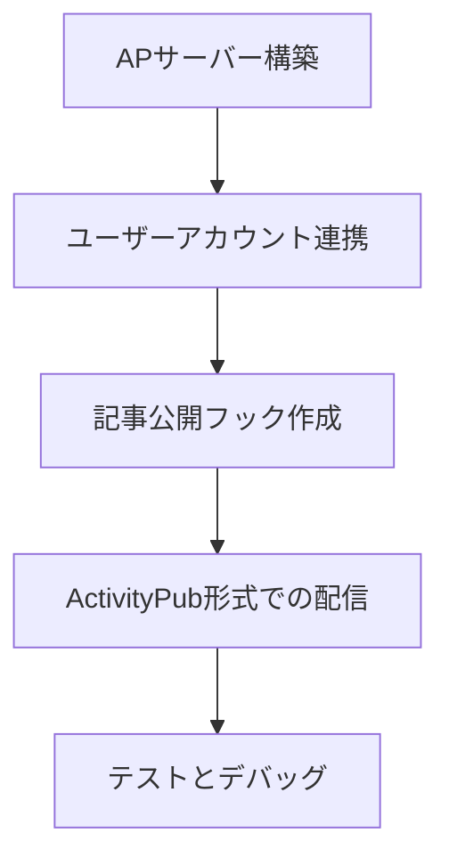

# ActivityPub連携設計書

## 実装ステップ



1. **APサーバー構築**
   - Go言語でActivityPubプロトコルを実装
   - Webfingerエンドポイント作成
   - Actorオブジェクト定義

2. **ユーザーアカウント連携**
   - Mastodonアカウントとの連携機能
   - OAuth2認証フロー実装
   - ユーザー設定画面追加

3. **記事公開フック作成**
   - 記事保存時にイベント発火
   - 公開ステータス変更検知
   ```go
   func (a *Article) Publish() {
       // 公開処理
       go triggerAPUpdate(a)
   }
   ```

4. **ActivityPub形式での配信**
   - Createアクティビティの生成
   - 署名付きHTTP POST送信
   - フォロワーへの一斉配信

5. **テストとデバッグ**
   - Mastodonテストサーバー構築
   - エンドツーエンドテスト
   - セキュリティ監査

## 技術要件
- ActivityPub仕様準拠
- HTTP Signatures実装
- 非同期処理用ワーカー
- エラーログ監視システム

## 考慮事項
⚠️ セキュリティ対策が必要
⚠️ パフォーマンス影響評価
⚠️ スパム対策機構の実装